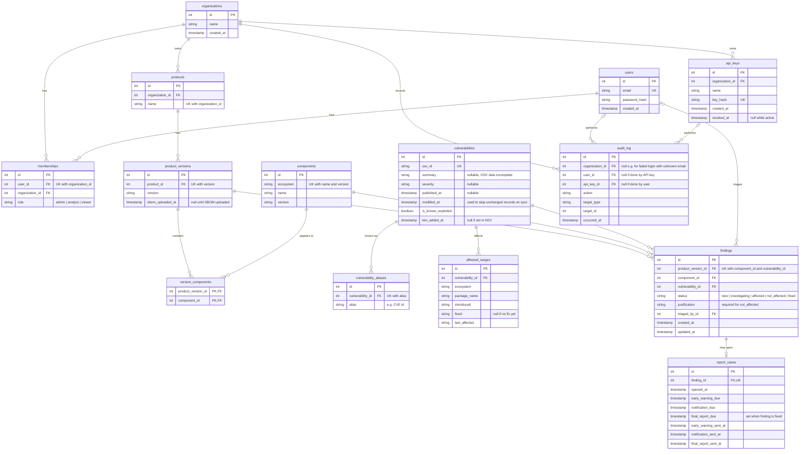

# ER Model

```mermaid
erDiagram
    organizations ||--o{ memberships : has
    users ||--o{ memberships : has
    organizations ||--o{ api_keys : owns
    organizations ||--o{ products : owns
    products ||--o{ product_versions : has
    product_versions ||--o{ version_components : contains
    components ||--o{ version_components : "appears in"
    vulnerabilities ||--o{ vulnerability_aliases : "known as"
    vulnerabilities ||--o{ affected_ranges : affects
    product_versions ||--o{ findings : has
    components ||--o{ findings : "found in"
    vulnerabilities ||--o{ findings : causes
    users |o--o{ findings : triages
    findings ||--o| report_cases : "may open"
    organizations ||--o{ audit_log : records
    users |o--o{ audit_log : performs
    api_keys |o--o{ audit_log : performs

    organizations {
        int id PK
        string name
        timestamp created_at
    }
    users {
        int id PK
        string email UK
        string password_hash
        timestamp created_at
    }
    memberships {
        int id PK
        int user_id FK "UK with organization_id"
        int organization_id FK
        string role "admin | analyst | viewer"
    }
    api_keys {
        int id PK
        int organization_id FK
        string name
        string key_hash UK
        timestamp created_at
        timestamp revoked_at "null while active"
    }
    products {
        int id PK
        int organization_id FK
        string name "UK with organization_id"
    }
    product_versions {
        int id PK
        int product_id FK "UK with version"
        string version
        timestamp sbom_uploaded_at "null until SBOM uploaded"
    }
    components {
        int id PK
        string ecosystem "UK with name and version"
        string name
        string version
    }
    version_components {
        int product_version_id PK, FK
        int component_id PK, FK
    }
   vulnerabilities {
        int id PK
        string osv_id UK
        string summary "nullable, OSV data incomplete"
        string severity "nullable"
        timestamp published_at "nullable"
        timestamp modified_at "used to skip unchanged records on sync"
        boolean is_known_exploited
        timestamp kev_added_at "null if not in KEV"
    }
    vulnerability_aliases {
        int id PK
        int vulnerability_id FK "UK with alias"
        string alias "e.g. CVE id"
    }
    affected_ranges {
        int id PK
        int vulnerability_id FK
        string ecosystem
        string package_name
        string introduced
        string fixed "null if no fix yet"
        string last_affected
    }
    findings {
        int id PK
        int product_version_id FK "UK with component_id and vulnerability_id"
        int component_id FK
        int vulnerability_id FK
        string status "new | investigating | affected | not_affected | fixed"
        string justification "required for not_affected"
        int triaged_by_id FK
        timestamp created_at
        timestamp updated_at
    }
    report_cases {
        int id PK
        int finding_id FK, UK
        timestamp opened_at
        timestamp early_warning_due
        timestamp notification_due
        timestamp final_report_due "set when finding is fixed"
        timestamp early_warning_sent_at
        timestamp notification_sent_at
        timestamp final_report_sent_at
    }
    audit_log {
        int id PK
        int organization_id FK "null e.g. for failed login with unknown email"
        int user_id FK "null if done by API key"
        int api_key_id FK "null if done by user"
        string action
        string target_type
        int target_id
        timestamp occurred_at
    }
```